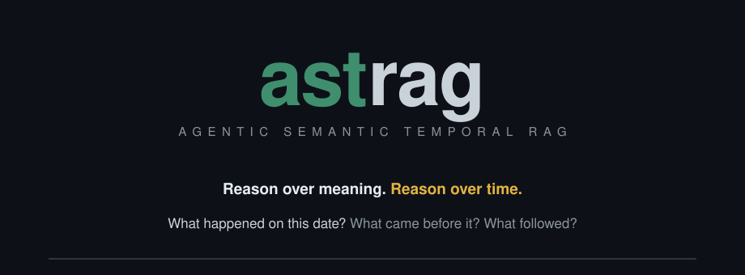

<p align="center">
  
</p>

# ASTRAG

**Agentic Semantic Temporal Retrieval-Augmented Generation**

An evidence-grounded agentic RAG system for general-purpose document QA, specifically optimized and evaluated for **historical and temporal** questions.

Most RAG systems retrieve on meaning alone. ASTRAG retrieves on **meaning and time**, and treats the user's chosen evidence sources as a hard boundary the agent cannot cross.

---

## The problem it solves

Ask a RAG system *"what happened between 1943 and 1945?"* or *"what came before this event?"* and semantic similarity alone gives you plausible, badly-ordered, often wrong answers. Dates, ranges, ordering, and temporal uncertainty are second-class citizens in a vector index.

ASTRAG makes them first-class: temporal metadata is extracted at ingestion, reasoned over at retrieval, and preserved through context assembly into the final answer.

## What a user does

1. Upload documents, organize them into **corpora**.
2. Per query, select which corpora to search and whether the **web** is allowed.
3. Ask a question in natural language.
4. Get an answer grounded in retrieved evidence, with citations — or an explicit *"insufficient evidence"*.

Questions it targets:

- What happened on this date?
- What major events happened between two dates?
- What happened before / after event X?
- What do my selected documents say about this?
- What exists in both my documents and on the web?

## The evidence contract

Query-level source configuration is authoritative. The agent decides *how* to retrieve; it never decides *what it's allowed to read*.

| Corpora selected | Web | Behaviour |
|---|---|---|
| yes | OFF | selected corpora only |
| yes | ON | selected corpora **and** web (web retrieval is mandatory) |
| no | ON | web only |
| no | OFF | query rejected — no evidence source |

Invariants that hold across every stage:

- Unselected corpora never contribute factual evidence.
- Provenance survives ingestion → retrieval → context assembly → generation.
- Conflicting evidence is exposed, not silently reconciled.
- Duplicate evidence never masquerades as independent corroboration.
- Model pretraining knowledge may aid reasoning; it may not substitute for missing evidence.
- Insufficient evidence is a valid outcome, not a failure.

## Architecture

```text
Upload / Update
   ↓
Ingestion → canonical evidence (immutable versions + generations)
   ↓
Validated search publication
   ↓
PostgreSQL search projections (dense + lexical + temporal)
   ↓
Query + selected corpora + web flag + short-term conversation context
   ↓
Query & temporal understanding
   ↓
Agent orchestration  ── enforces the configured source boundary
   ├── local corpus retrieval (dense ∥ lexical ∥ temporal routes → RRF)
   └── web retrieval (when web is ON)
   ↓
Evidence pipeline → context assembly → grounded generation
   ↓
Answer + citations + conflict / uncertainty disclosure
```

Canonical evidence is authoritative; every search index is a **rebuildable projection** of it. Retrieval verifies eligibility at query time so deleted documents and stale generations can never leak into an answer.

## Tech stack

**Decided (V1, via accepted ADRs):**

| Concern | Choice |
|---|---|
| Canonical store | PostgreSQL — corpora, document lifecycle, immutable versions, generations, chunks, temporal mentions |
| Dense retrieval | pgvector, exact search (no ANN until benchmarks demand it) |
| Lexical retrieval | PostgreSQL full-text search + a bounded literal/phrase fallback |
| Temporal retrieval | dedicated temporal candidate route participating in fusion |
| Fusion | Reciprocal Rank Fusion — dense/lexical/temporal scores aren't comparable, so rank-fuse rather than pretend |
| Reranking | none in the V1 baseline; added only when evaluation shows fusion ordering falls short |
| Large artifacts | `ArtifactStore` abstraction (local FS / object storage) for source files and normalized documents |
| Web search | Tavily is the intended provider; swappable without an ADR revisit |
| Ingest formats | text-extractable PDF / TXT / Markdown / DOCX (no OCR, no multimodal in V1) |

**Deliberately deferred** until there's evidence to decide on: embedding model/provider, generation model/provider, agent framework, parser libraries, temporal-extraction libraries, chunk sizing, RRF constant and candidate budgets, ANN index type, context token budgeting, prompt architecture, API schema, caching, production topology.

**V1 envelope:** single tenant, low concurrency, hundreds–thousands of documents, ~1M chunks, one embedding model, one globally active search generation.

## Status

Stages 1–3 are accepted design. **Stage 2 (ingestion) is implemented**: upload a TXT, Markdown or PDF document and it is parsed, normalized, chunked, temporally annotated, embedded, validated and published as searchable, with durable job state and crash recovery. DOCX is the remaining format. Retrieval (Stage 3) is not built yet — there is no search endpoint.

## Try it end to end

Python 3.12 and `uv`; Docker for the database. The default embedding provider is a deterministic offline fake, so no API key is needed.

```bash
uv sync --extra dev
docker compose up -d                 # PostgreSQL 17 + pgvector on localhost:5433
uv run alembic upgrade head
```

Two processes — the API accepts uploads, the worker ingests them:

```bash
uv run uvicorn astrag.api.app:app --reload     # terminal 1
uv run python -m astrag.worker                 # terminal 2
```

Create a corpus and upload a document:

```bash
cat > rome.md <<'EOF'
# Roman Republic

The Republic was founded in 509 BCE after the overthrow of the monarchy.

## Fall of the Republic

Caesar was assassinated on 15 March 44 BCE. Augustus took power in 27 BCE,
ending the Republic and beginning the Principate.
EOF

CORPUS=$(curl -s -X POST localhost:8000/corpora \
  -H 'content-type: application/json' -d '{"name":"rome"}' | jq -r .id)

DOC=$(curl -s -X POST localhost:8000/corpora/$CORPUS/documents \
  -F file=@rome.md | jq -r .document_id)
```

The upload returns immediately with `"status": "PENDING"`. Poll the status contract until the worker publishes it:

```bash
curl -s localhost:8000/documents/$DOC | jq
```

```json
{
  "document_version_id": "d51497b2-…",
  "active_version_id": "d51497b2-…",
  "status": "READY",
  "current_stage": "publish",
  "degraded_capabilities": {},
  "error_summary": null
}
```

`active_version_id` equal to `document_version_id` means this version passed publication validation and is the one retrieval would see. `READY_DEGRADED` with `{"temporal": "degraded"}` means the document is searchable but temporal extraction failed; `FAILED` puts the reason in `error_summary`.

### See what ingestion actually produced

```bash
psql() { docker compose exec -T db psql -U astrag -d astrag -c "$1"; }

# chunks — structure-aware, token-bounded, with their section path
psql "SELECT c.ordinal, c.token_count, c.section_path, left(c.source_text, 55)
      FROM chunks c JOIN document_versions v ON v.id = c.document_version_id
      WHERE v.document_id = '$DOC' ORDER BY c.ordinal;"

# temporal mentions — precision, certainty, and the chunk each is anchored to
psql "SELECT m.text, m.precision, m.certainty, m.start_year, c.ordinal
      FROM temporal_mentions m JOIN chunks c ON c.id = m.chunk_id
      JOIN document_versions v ON v.id = c.document_version_id
      WHERE v.document_id = '$DOC' ORDER BY m.start_year;"

# dense representations — one 1536-dim vector per chunk
psql "SELECT c.ordinal, r.model, vector_dims(r.embedding), r.input_tokens
      FROM chunk_representations r JOIN chunks c ON c.id = r.chunk_id
      JOIN document_versions v ON v.id = c.document_version_id
      WHERE v.document_id = '$DOC' ORDER BY c.ordinal;"

# the ingestion attempt itself — stage checkpoint, attempt number, queue state
psql "SELECT r.stage, r.attempt, r.finished_at IS NOT NULL AS finished, j.state
      FROM ingestion_runs r JOIN ingestion_jobs j USING (document_version_id)
      JOIN document_versions v ON v.id = r.document_version_id
      WHERE v.document_id = '$DOC';"
```

For that document you should see two chunks (one per section, the heading leading its own chunk), three temporal mentions with `509 BCE` at `YEAR` precision and `15 March 44 BCE` at `DAY`, one vector per chunk, and a single finished attempt checkpointed at `publish`.

Upload a PDF the same way (`-F file=@paper.pdf`). Pages are evidence, so `page_start`/`page_end` are populated for paginated formats and null for the rest:

```bash
psql "SELECT c.ordinal, c.page_start, c.page_end, left(c.source_text, 45)
      FROM chunks c JOIN document_versions v ON v.id = c.document_version_id
      WHERE v.document_id = '$DOC' ORDER BY c.ordinal;"
```

Running headers and page-number footers are stripped before chunking, and each removal is recorded as a parser warning rather than dropped silently. A password-protected, corrupt, or scanned-image-only PDF fails non-retryably with the reason in `error_summary` — OCR is out of V1 scope.

### Replace and delete

```bash
curl -s -X PUT localhost:8000/documents/$DOC -F file=@rome-v2.md   # new version
curl -s -X DELETE localhost:8000/documents/$DOC -o /dev/null -w '%{http_code}\n'   # 204
```

A replacement builds a whole new version while the previous one stays active and searchable; the pointer moves only when the new version's own run publishes. Delete cascades to versions, chunks, mentions and vectors in one transaction, then sweeps artifacts no other document still references.

### Watch crash recovery

Kill the worker mid-ingestion (`Ctrl-C` twice, or `pkill -9 -f astrag.worker`) and start it again. Within `ASTRAG_STALE_JOB_SECONDS` (default 300) it reclaims the abandoned job, continues the same attempt rather than burning a new one, resumes at the checkpointed stage, and reuses the normalized artifact and chunk rows that were already durable — so nothing is re-parsed and no vector is bought twice.

### Tests

```bash
uv run pytest                         # 164 tests, needs docker compose up
uv run pytest tests/test_end_to_end.py -v   # upload → searchable, plus crash-resume
```

To use real OpenAI embeddings instead of the fake: `ASTRAG_EMBEDDING_PROVIDER=openai ASTRAG_OPENAI_API_KEY=sk-…`. All configuration is env-driven with the `ASTRAG_` prefix; see `.env.example`.

## Repository

| Path | Contents |
|---|---|
| `NORTHSTAR.md` | the goal and the non-negotiable evidence invariants |
| `stages.md` | the 10-stage implementation roadmap |
| `docs/architecture/architecture.md` | current accepted end-to-end architecture |
| `docs/architecture/decisions/` | ADRs — the decisions and why they were made |
| `docs/stages/` | per-stage design documents |

Read order for a change: `NORTHSTAR.md` → relevant ADRs → `architecture.md` → the owning stage document.
